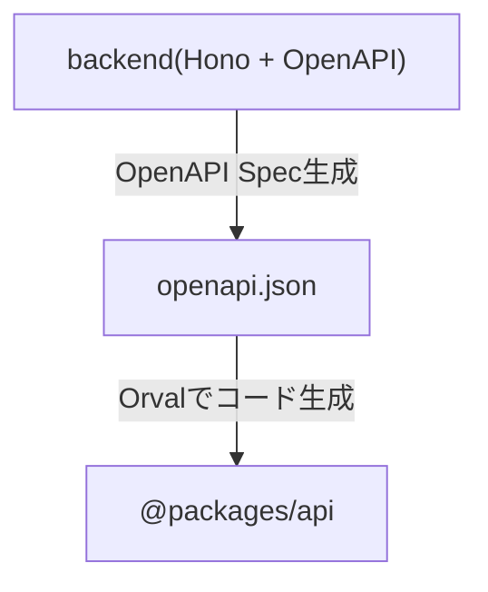

## はじめに

バックエンドのAPIを変更したら、フロントエンドでフィールドの抜け漏れや型が異なることによるエラーが出るようにする。
そんな開発体験を実現するために、Hono + OpenAPI + Orvalの構成を紹介します。

バックエンドで定義したAPIエンドポイントの型を共有できるHono RPCもありますが、`useQuery`や`useMutation`を追加で用意する必要があり、そこを負担してくれるOrvalを使うようにしました。

今回は、ミニマルなタスク管理アプリを例に作ってみます。

リポジトリ:
https://github.com/Takashicc/todo-app-hono

## アーキテクチャ概要

以下の流れでバックエンドの型定義をフロントエンドに共有します。



## プロジェクト作成

honoのプロジェクトを作成します。
Cloudflareが提供しているテンプレートを使って作成します。

https://developers.cloudflare.com/workers/framework-guides/web-apps/more-web-frameworks/hono/

パッケージマネージャーは`pnpm`を使います。

```sh
pnpm create cloudflare@latest todo-app-hono --template=cloudflare/templates/vite-react-template
```

以下のようなフォルダ構成でプロジェクトが作成され、`src`フォルダ配下にある`react-app`がフロントエンド、`worker`がバックエンドとなります。

```sh
.
├── eslint.config.js
├── index.html
├── node_modules
├── package-lock.json
├── package.json
├── pnpm-lock.yaml
├── public
│   └── vite.svg
├── README.md
├── src
│   ├── react-app
│   └── worker
├── tsconfig.app.json
├── tsconfig.json
├── tsconfig.node.json
├── tsconfig.worker.json
├── vite.config.ts
├── worker-configuration.d.ts
└── wrangler.json
```

必要なライブラリを追加します。

```sh
pnpm add valibot hono-openapi @valibot/to-json-schema @hono/swagger-ui tsx
pnpm add --save-dev orval
```

また、これからバックエンドで`/api/...`エンドポイントを実装していくのですが、テンプレートのままだと`/api/...`にリクエストを投げた時にアセットが優先されてWorkerが実行されないため、この挙動を変更してあげる必要があります。
`wrangler.json`に`assets.run_worker_first`設定を追記することで、`/api/...`エンドポイントでリクエストが投げられたら、Workerを優先して実行させるようにします。

```diff
{
  "$schema": "node_modules/wrangler/config-schema.json",
  "name": "todo-app-hono",
  "main": "./src/worker/index.ts",
  "compatibility_date": "2025-10-08",
  "compatibility_flags": ["nodejs_compat"],
  "observability": {
    "enabled": true
  },
  "upload_source_maps": true,
  "assets": {
    "directory": "./dist/client",
    "not_found_handling": "single-page-application",
+    "run_worker_first": ["/api/*"]
  }
}
```

### バックエンドの実装

Todoを操作するAPIを定義します。
全量載せるとコードが長くなるので、ID指定取得と作成するAPIのみを例に出します。

#### リクエスト・レスポンスの型定義

まずはリクエストとレスポンスの型定義をValibotを使って行います。

```ts:src/worker/index.ts
import * as v from "valibot";

const todoSchema = v.object({
	id: v.string(),
	title: v.string(),
	completed: v.boolean(),
});
type Todo = v.InferOutput<typeof todoSchema>;

const todoIdSchema = v.pipe(v.string(), v.uuid());
const todoTitleSchema = v.pipe(v.string(), v.nonEmpty());

// GET /api/todos/:id
const getTodoParamSchema = v.object({
  id: todoIdSchema,
});
const getTodoResponseSchema = v.object({
  todo: todoSchema,
});
type GetTodoResponse = v.InferOutput<typeof getTodoResponseSchema>;

// POST /api/todos
const createTodoRequestSchema = v.object({
	title: todoTitleSchema,
});
const createTodoResponseSchema = todoSchema;
type CreateTodoResponse = v.InferOutput<typeof createTodoResponseSchema>;
```

#### Todoエンドポイント

リクエスト・レスポンスの型定義を使ってエンドポイントを組み立てます。

`hono-openapi`というライブラリを使ってOpenAPI定義を書きます。
以下のページは`Valibot`と一緒に使う例を載せた公式ドキュメントです。

https://honohub.dev/docs/openapi/valibot

`describeRoute`関数を使って、OpenAPI Specを定義します。

:::message
`describeResponse`という関数もあり、

https://honohub.dev/docs/openapi/valibot#adding-typesense-for-response-body

これはレスポンスのステータスコードとボディを定義することで、実際の処理で返却するレスポンスの型を強制させるというものです。
`describeRoute`と一緒に使えますが、`c.req.valid()`が型エラーによって今のところ使えないので、`describeRoute`だけを使います。

https://github.com/rhinobase/hono-openapi/issues/145
:::

自分が少しハマった点として、以下のコードでは`hono-openapi`からインポートした`validator`を使っていますが、似たような名前で`@hono/standard-validator`からインポートできる`sValidator`をバリデーションに使うことができます。
ただ、これを使った場合にOpenAPI定義からごっそりその部分がなくなってしまうので、`hono-openapi`にある`validator`を使うよう注意しましょう。

```ts:src/worker/index.ts
import { Hono } from "hono";
import {
  describeRoute,
  resolver,
  validator,
} from "hono-openapi";
import * as v from "valibot";

const todos: Todo[] = [];

const app = new Hono<{ Bindings: Env }>()
  .basePath("/api")
  .get(
    "/todos/:id",
    validator("param", getTodoParamSchema),
    describeRoute({
      description: "Get a todo by id",
      responses: {
        200: {
          description: "Success",
          content: {
            "application/json": {
              schema: resolver(getTodoResponseSchema),
            },
          },
        },
        404: {
          description: "Todo not found",
          content: {
            "application/json": {
              schema: resolver(errorResponseSchema),
            },
          },
        },
      },
    }),
    (c) => {
      const { id } = c.req.valid("param");
      const todo = todos.find((todo) => todo.id === id);
      if (!todo) {
        return c.json<ErrorResponse>({ error: "Todo not found" }, 404);
      }
      return c.json<GetTodoResponse>({ todo });
    },
  )
  .post(
    "/todos",
    validator("json", createTodoRequestSchema),
    describeRoute({
      description: "Create a todo",
      responses: {
        200: {
          description: "Success",
          content: {
            "application/json": {
              schema: resolver(createTodoResponseSchema),
            },
          },
        },
      },
    }),
    (c) => {
      const { title } = c.req.valid("json");
      const id = crypto.randomUUID();
      const todo = { id, title, completed: false };
      todos.push(todo);
      return c.json<CreateTodoResponse>(todo);
    },
  );

export default app;
```

#### OpenAPIエンドポイント

OpenAPIのJSONファイルを取得できるエンドポイントと、SwaggerUIを確認できるエンドポイントを用意します。
デフォルトのままだとOpenAPIエンドポイントもOpenAPIのJSONに含まれるため、`exclude`を使って除外します。

```ts:src/worker/index.ts
import { swaggerUI } from "@hono/swagger-ui";
import { GenerateSpecOptions, openAPIRouteHandler } from "hono-openapi";

export const openAPISpecOptions: Partial<GenerateSpecOptions> = {
  documentation: {
    info: {
      title: "Todo API",
      version: "1.0.0",
    },
  },
  includeEmptyPaths: true,
  exclude: ["/api/openapi.json", "/api/openapi/swagger-ui"],
};

app
  .get("/openapi.json", openAPIRouteHandler(app, openAPISpecOptions))
  .get("/openapi/swagger-ui", swaggerUI({ url: "/api/openapi.json" }));
```

これで`pnpm run dev`を実行して、`http://localhost:5173/api/openapi/swagger-ui`に行くことで、以下のような画面が確認できるようになります。


#### OpenAPIファイルの生成

バックエンドに定義したOpenAPI SpecからOpenAPIファイルを生成するスクリプトを用意します。

https://honohub.dev/docs/openapi/persisting

```ts:src/worker/scripts/generate-openapi-specs.ts
import { generateSpecs } from "hono-openapi";
import fs from "node:fs";
import app, { openAPISpecOptions } from "..";

async function main() {
  const specs = await generateSpecs(app, openAPISpecOptions);
  fs.writeFileSync("./openapi.json", JSON.stringify(specs));
}

main();
```

このままだと`Cannot find module 'node:fs' or its corresponding type declarations`というエラーが表示されます。
これは、上記のスクリプトで`node:fs`ライブラリを使っていますが、型定義が見つからず、型チェックやモジュール解決ができないため発生しています。
以下のように`tsconfig.worker.json`でNode.jsの型定義を読み込むように修正します。

```diff:tsconfig.worker.json
{
  "extends": "./tsconfig.node.json",
  "compilerOptions": {
    "tsBuildInfoFile": "./node_modules/.tmp/tsconfig.worker.tsbuildinfo",
-    "types": ["vite/client", "./worker-configuration.d.ts"]
+    "types": ["vite/client", "./worker-configuration.d.ts", "node"]
  },
  "include": ["src/worker"]
}
```

`package.json`に用意したスクリプトを実行できるようにコマンドを設定します。

```diff:package.json
{
  "scripts": {
+    "generate": "tsx ./src/worker/scripts/generate-openapi-spec.ts",
  },
}
```

`pnpm run generate`を実行することで、プロジェクトのルートディレクトリに`openapi.json`が生成されます。

### APIクライアントの生成

生成されたOpenAPIファイルからOrvalを使ってTanStack Queryを使ったAPIクライアントを生成します。
まず、`packages/api`に生成したAPIクライアントを置くため、pnpm workspaceを設定します。

https://pnpm.io/ja/workspaces

https://pnpm.io/ja/catalogs

`catalog`には共通して使うライブラリを書きます。tsdownはビルドに使います。

```yaml:pnpm-workspace.yaml
packages:
  - packages/*

catalog:
  "@tanstack/react-query": ^5.90.9
  tsdown: ^0.15.12
  typescript: 5.8.3
```

`packages/api`のセットアップを行います。

```json:packages/api/package.json
{
  "name": "@packages/api",
  "private": true,
  "type": "module",
  "scripts": {
    "build": "orval --config ./orval.config.ts && tsdown --config ./tsdown.config.ts",
    "watch": "tsdown --watch --config ./tsdown.config.ts",
    "typecheck": "tsc --noEmit"
  },
  "dependencies": {
    "@tanstack/react-query": "catalog:",
    "axios": "^1.13.2"
  },
  "devDependencies": {
    "tsdown": "catalog:",
    "typescript": "catalog:"
  }
}
```

Orvalの設定ファイルを用意します。プロジェクトルートに生成された`openapi.json`ファイルを元にTanStack Query、axiosを使ったAPIクライアントを作成するように設定しています。

https://orval.dev/guides/react-query

また、`useSuspenseQuery`が使いたい場合は、`override.query`設定を追加することで生成できます。

https://zenn.dev/galapagos/articles/86666ca2d3805e

```ts:packages/api/orval.config.ts
import { defineConfig } from "orval";

export default defineConfig({
  "todo-app-api": {
    input: "../../openapi.json",
    output: {
      target: "./src/index.ts",
      client: "react-query",
      biome: true,
      override: {
        query: {
          useSuspenseQuery: true,
          version: 5,
        },
      },
    },
  },
});
```

`tsconfig.json`を用意します。

```ts:packages/api/tsconfig.json
{
  "compilerOptions": {
    "target": "ESNext",
    "module": "ESNext",
    "moduleResolution": "Bundler",
    "declaration": true,
    "declarationMap": true,
    "strict": true,
    "noUnusedLocals": true,
    "noUnusedParameters": true,
    "noFallthroughCasesInSwitch": true,
    "noUncheckedIndexedAccess": true,
    "noImplicitOverride": true,
    "noUncheckedSideEffectImports": true,
    "esModuleInterop": true,
    "allowSyntheticDefaultImports": true,
    "skipLibCheck": true,
    "forceConsistentCasingInFileNames": true,
    "resolveJsonModule": true,
    "isolatedModules": true,
    "paths": {
      "@/*": ["./src/*"]
    },
    "outDir": "./dist",
    "rootDir": "./src"
  },
  "include": ["src/**/*"],
  "exclude": ["node_modules", "dist", "**/*.test.ts", "**/*.spec.ts"]
}
```

tsdownを使ってビルドするため、`tsdown.config.ts`設定ファイルを用意します。

https://tsdown.dev/reference/api/Interface.UserConfig

```ts:packages/api/tsdown.config.ts
import { defineConfig } from "tsdown";

export default defineConfig({
  entry: ["./src/index.ts"],
  dts: {
    sourcemap: true,
  },
  target: false,
  platform: "browser",
  minify: true,
  exports: true,
});
```

:::message
experimentalな機能である`exports: true`について、`package.json`にもexport設定が必要ですが、`exports: true`を設定することで、export設定をtsdownでビルド時に`package.json`へ自動的に反映できます。

`packages/api`で`pnpm run build`すると、以下のように設定が追記されます。

```diff:packages/api/package.json
{
  "name": "@packages/api",
  "private": true,
  "type": "module",
  "scripts": {
    "build": "orval --config ./orval.config.ts && tsdown --config ./tsdown.config.ts",
    "watch": "tsdown --watch --config ./tsdown.config.ts",
    "typecheck": "tsc --noEmit"
  },
  "dependencies": {
    "@tanstack/react-query": "catalog:",
    "axios": "^1.13.2"
  },
  "devDependencies": {
    "tsdown": "catalog:",
    "typescript": "catalog:"
  },
+  "main": "./dist/index.js",
+  "module": "./dist/index.js",
+  "types": "./dist/index.d.ts",
+  "exports": {
+    ".": "./dist/index.js",
+    "./package.json": "./package.json"
+  }
}
```

:::

最後に空の`src/index.ts`を用意して、`cd packages/api`、`pnpm run build`を実行すると、APIクライアントが自動生成されます。

### フロントエンドの実装

まず、`package.json`に`@packages/api`を追加することでAPIクライアントを使えるようにします。

```diff:package.json
  "dependencies": {
+    "@packages/api": "workspace:*"
  },
```

tailwindcssやTanStack Queryなどセットアップもありますが、尺が長くなるので省略します。
以下のコミットからセットアップ内容を確認できます。

https://github.com/Takashicc/todo-app-hono/commit/ecc975d892c479efdb7af559953e92981e8194e3

セットアップした後、`@packages/api`から`useXXX`をインポートして使うことができます。
レスポンスの型がちゃんと定義されており、補完が効くほか、バックエンドに変化があった場合はAPIクライアントを再生成することで、フィールドの抜け漏れや型違いの同期ずれを防ぐことができます。

```ts:src/react-app/App.tsx
import {
  getGetApiTodosQueryKey,
  useGetApiTodosSuspense,
  usePostApiTodos,
  usePutApiTodosId,
} from "@packages/api";
import { useQueryClient } from "@tanstack/react-query";
import { useState } from "react";

function App() {
  const queryClient = useQueryClient();
  const [title, setTitle] = useState("");

  const todosQuery = useGetApiTodosSuspense();
  const todos = todosQuery.data.data.todos;
  const completedCount = todos.filter((t) => t.completed).length;

  const createTodoMutation = usePostApiTodos({
    mutation: {
      onSuccess: () => {
        queryClient.invalidateQueries({ queryKey: getGetApiTodosQueryKey() });
      },
    },
  });

  const updateTodoMutation = usePutApiTodosId({
    mutation: {
      onSuccess: () => {
        queryClient.invalidateQueries({ queryKey: getGetApiTodosQueryKey() });
      },
    },
  });

  return ...;
}
```

フロントエンドの画面の実装後、`pnpm run dev`を実行することでローカルから画面を確認できます。


## おわりに

セットアップに少し時間はかかりますが、この構成を使うことでバックエンドとフロントエンドのAPI齟齬を少なくでき、ミスの少ない安全な開発ができるようになります。

特に、チーム開発においてはAPIの変更による影響範囲を事前に把握でき、リファクタリングやAPI設計の変更も安心して行えるようになります。また、OpenAPI仕様書が自動生成されるため、ドキュメントメンテナンスの負担も軽減されます。

ぜひ型安全な開発体験をお試しください。
