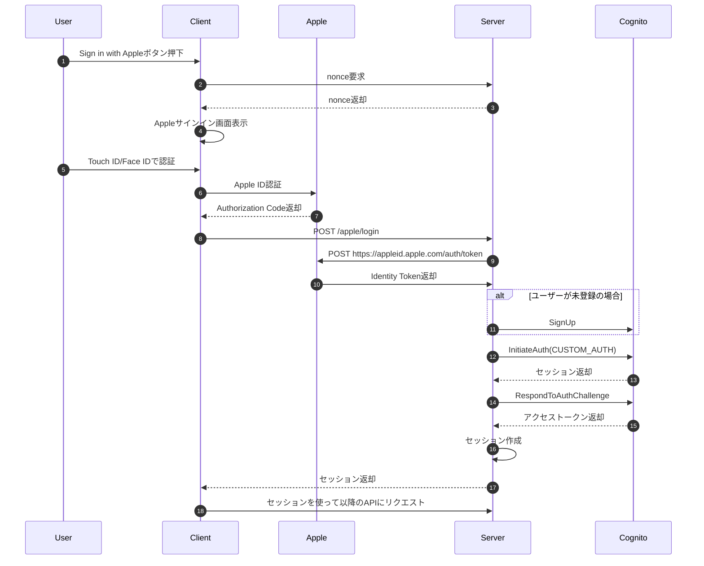
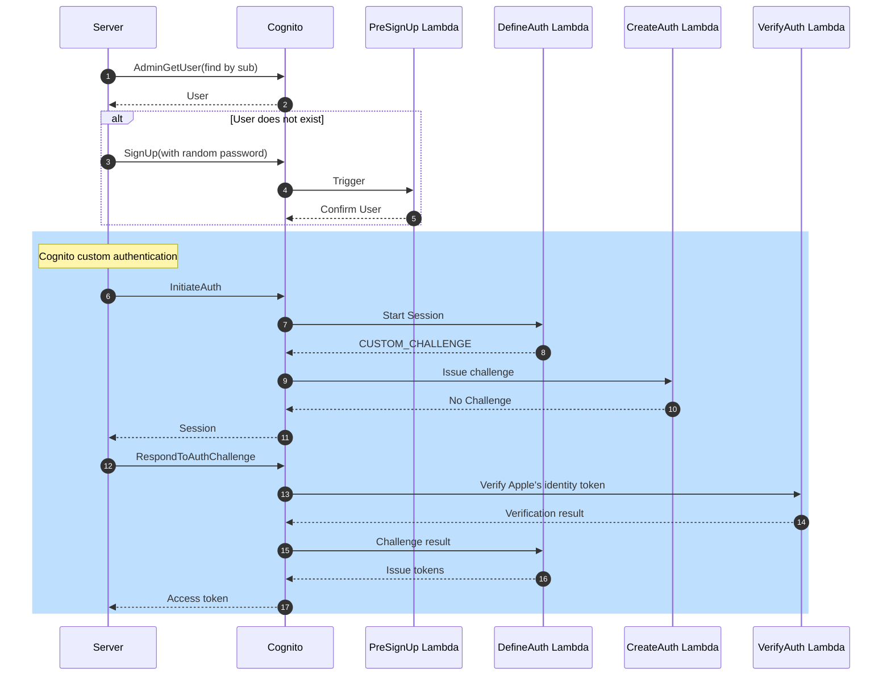

:::message
この記事は[ambr, Inc. Advent Calendar 2024](https://adventar.org/calendars/10507)の24日目の記事です。
:::

こんにちは、サーバーサイドエンジニアのTakashiccです。
今回は[gogh](https://gogh.gg)のアップデートで導入した、Sign in with Appleの実装の紹介をしていきたいと思います。
なお、今後はSign in with AppleをSIWAと省略します。

# なぜSIWAを導入したのか

[gogh](https://gogh.gg)では、従来よりメールアドレスや電話番号でのアカウント登録をサポートしてきました。
しかし、以下のような課題がありました。

- 認証メールの遅延
    - Gmailでの登録が1日に集中すると認証メールの配信に遅延が発生(SPFやDMARCなどは設定しています)
    - Twitterなどでバズると認証メールが届かないことが原因で、アカウント登録できない問い合わせが続出。
- ユーザー体験
    - メールアドレスや電話番号での登録は、パスワードや認証メールなど複数のステップが原因で離脱の原因になっていました。
    - パスワード再設定が当時なかったため、パスワードを忘れたユーザーはもう一度アカウントを作成する必要がありました。

これらの課題を解決するため、Touch ID/Face IDによる生体認証でスムーズなログインが可能なSIWAを導入しました。

# CognitoのSIWA対応状況について

CognitoはSIWAをサポートしていますが、ホステッドUIのみサポートしており、iOSネイティブでのTouch ID(指紋認証)やFace ID(顔認証)をサポートしていません。

https://github.com/aws-amplify/aws-sdk-ios/issues/2633

今回は、Touch IDやFace IDを使った円滑なログイン体験を提供したかったため、Cognitoのカスタム認証を使うことになりました。

https://docs.aws.amazon.com/cognito/latest/developerguide/user-pool-lambda-challenge.html

# 全体のフロー

簡単にですが、全体のフローです。
ServerとCognito間の疎通に関しても簡略しています。(詳細フローは[後述](#cognitoへの登録〜アクセストークン取得まで)します)



# 実装手順

## Appleログインエンドポイントの実装

公式の[Verifying a user](https://developer.apple.com/documentation/sign_in_with_apple/sign_in_with_apple_rest_api/verifying_a_user)を参考に実装しています。

### Request body

実際は`nonce`など他のフィールドもありますが、ここでは省略します。

```go
type AppleLoginRequest struct {
  AuthorizationCode string `json:"authorization_code" binding:"required"`
}
```

### Authorization Codeを使ってIdentity Tokenを取得

リクエスト内容の検証後、Authorization Codeを使って、Apple Id ServerからIdentity Tokenを取得します。
クライアント側でAuthorization Codeと一緒にIdentity Tokenも取得できますが、サーバー側でAuthorization Codeを使ってApple Id ServerからIdentity Tokenを取得する方がよりセキュアです。
また、Authorization Codeは1度しか使えず、5分間のみ有効な値です。

以下がAuthorization CodeからIdentity Tokenを取得するAPIのドキュメントです。
https://developer.apple.com/documentation/sign_in_with_apple/generate_and_validate_tokens

上記のAPIを叩くわけですが、渡すパラメータに[client_secret](https://developer.apple.com/documentation/accountorganizationaldatasharing/creating-a-client-secret)というものがあります。
まずはこれを用意しましょう。

#### Client Secretの生成

Client Secretについての公式ドキュメントは以下です。
https://developer.apple.com/documentation/accountorganizationaldatasharing/creating-a-client-secret

Client Secretは固定値ではなく、Apple Developerコンソールから取得できる秘密鍵を使って生成する必要があります。
また、生成するClient Secretは有効期限も設定する必要があるため、無効になっていた場合は再生成するように管理してあげなければなりません。

以下の記事を参考に実装しています。
https://zenn.dev/ytakaya/articles/a748aa8570fe52

使用ライブラリが参考記事とは異なりますが、処理内容はほぼ同じです。
`APPLE_TEAM_ID`、`APPLE_BUNDLE_ID`、`APPLE_SECRET_KEY`、`APPLE_KEY_ID`は自身のApple Developerコンソールから確認できるものに変更する必要があります。
コード上ではハードコードしていますが、これらの値はAWS Secrets Managerなどセキュアな方法での管理をおすすめします。

:::details apple_client_secret_builder.go

```go:apple_client_secret_builder.go
import (
	"crypto/x509"
	"encoding/pem"
	"errors"
	"sync"
	"time"

	"github.com/lestrrat-go/jwx/v2/jwa"
	"github.com/lestrrat-go/jwx/v2/jws"
	"github.com/lestrrat-go/jwx/v2/jwt"
)

const (
	appleTeamId    = "APPLE_TEAM_ID"
	appleBundleId  = "APPLE_BUNDLE_ID"
	appleSecretKey = "APPLE_SECRET_KEY"
	appleKeyId     = "APPLE_KEY_ID"

	appleClientSecretExpiration     time.Duration = time.Hour * 24
	appleClientSecretValidityPeriod int64         = 60
	appleClientSecretAud            string        = "https://appleid.apple.com"
)

type appleClientSecretBuilder struct {
	payload  appleClientSecretPayload
	signer   jwt.SignEncryptParseOption
	mu       sync.RWMutex
	jwtCache string
}

type appleClientSecretPayload struct {
	iss string
	iat time.Time
	exp time.Time
	aud string
	sub string
}

// Appleのクライアントシークレットを生成するための構造体を返却する
func newAppleClientSecretBuilder() (*appleClientSecretBuilder, error) {
	signer, err := getSigner()
	if err != nil {
		return nil, err
	}

	res := &appleClientSecretBuilder{
		payload: appleClientSecretPayload{
			iss: appleTeamId,
			iat: time.Now(),
			exp: time.Now().Add(appleClientSecretExpiration),
			aud: appleClientSecretAud,
			sub: appleBundleId,
		},
		signer: signer,
	}
	_, err = res.getClientSecret(time.Now())
	if err != nil {
		return nil, err
	}

	return res, nil
}

// 署名に使用する秘密鍵を取得する
func getSigner() (jwt.SignEncryptParseOption, error) {
	block, _ := pem.Decode([]byte(appleSecretKey))
	if block == nil {
		return nil, errors.New("failed to parse PEM block containing the key")
	}

	privateKey, err := x509.ParsePKCS8PrivateKey(block.Bytes)
	if err != nil {
		return nil, err
	}

	hdr := jws.NewHeaders()
	if err := hdr.Set(jws.AlgorithmKey, jwa.ES256); err != nil {
		return nil, err
	}
	if err := hdr.Set(jws.KeyIDKey, appleKeyId); err != nil {
		return nil, err
	}
	signer := jwt.WithKey(jwa.ES256, privateKey, jws.WithProtectedHeaders(hdr))

	return signer, nil
}

// client secretが有効期限切れかどうかを返却する
// 1分前時点で有効期限切れとみなす
func (c *appleClientSecretBuilder) isExpired(at time.Time) bool {
	return c.payload.exp.Unix()-at.Unix() <= appleClientSecretValidityPeriod
}

// client secretをキャッシュから取得する
func (c *appleClientSecretBuilder) getJWTCache(at time.Time) (string, error) {
	c.mu.RLock()
	defer c.mu.RUnlock()
	if c.jwtCache == "" {
		return "", errors.New("apple client secret not found")
	}

	if c.isExpired(at) {
		return "", errors.New("apple client secret expired")
	}
	return c.jwtCache, nil
}

// client secretをキャッシュに保存する
func (c *appleClientSecretBuilder) setJWTCache(jwt string) {
	c.mu.Lock()
	defer c.mu.Unlock()
	c.jwtCache = jwt
}

// JWTを生成する
// https://developer.apple.com/documentation/accountorganizationaldatasharing/creating-a-client-secret
func (c *appleClientSecretBuilder) createJWT() (string, error) {
	t, err := jwt.NewBuilder().
		Issuer(c.payload.iss).
		IssuedAt(c.payload.iat).
		Expiration(c.payload.exp).
		Audience([]string{c.payload.aud}).
		Subject(c.payload.sub).
		Build()
	if err != nil {
		return "", err
	}

	signed, err := jwt.Sign(t, c.signer)
	if err != nil {
		return "", err
	}

	return string(signed), nil
}

// client secretを返却する
// 有効期限が切れている場合は新しいclient secretを生成して返却する
func (c *appleClientSecretBuilder) getClientSecret(at time.Time) (string, error) {
	j, err := c.getJWTCache(at)
	if err == nil {
		return j, nil
	}

	c.payload.iat = at
	c.payload.exp = at.Add(appleClientSecretExpiration)

	j, err = c.createJWT()
	if err != nil {
		return "", err
	}
	c.setJWTCache(j)

	return j, nil
}
```

:::

#### Generate and validate tokens Endpointを叩く

Client Secretが取得できるようになったら、Appleの[Generate and validate tokens](https://developer.apple.com/documentation/sign_in_with_apple/generate_and_validate_tokens)を叩き、Identity Tokenを取得します。

リクエスト形式が`application/x-www-form-urlencoded`であることに注意しましょう。

リクエストが成功すると`TokenResponse`が取得できるので、`TokenResponse.IdToken`からIdentity Tokenを参照できます。

:::details apple.go

```go:apple.go
package main

import (
	"context"
	"encoding/json"
	"errors"
	"fmt"
	"io"
	"net"
	"net/http"
	"net/url"
	"reflect"
	"strings"
	"time"

	"github.com/lestrrat-go/jwx/v2/jwk"
)

const (
	appleBundleId string = "APPLE_BUNDLE_ID"

	appleEndpointOrigin string = "https://appleid.apple.com"
	appleJWKsUrl        string = "https://appleid.apple.com/auth/keys"

	generateAndValidateTokensPath string = "auth/token"
)

type AppleClient struct {
	client              *http.Client
	origin              *url.URL
	jwkCache            *jwk.Cache
	clientSecretBuilder *appleClientSecretBuilder
}

func newAppleClient(ctx context.Context) (*AppleClient, error) {
	origin, err := url.Parse(appleEndpointOrigin)
	if err != nil {
		return nil, err
	}

	jwkCache := jwk.NewCache(ctx)
	err = jwkCache.Register(appleJWKsUrl, jwk.WithRefreshInterval(15*time.Minute))
	if err != nil {
		return nil, err
	}

	appleClientSecretBuilder, err := newAppleClientSecretBuilder()
	if err != nil {
		return nil, err
	}

	return &AppleClient{
		client: &http.Client{
			Timeout: 5 * time.Second,
		},
		origin:              origin,
		jwkCache:            jwkCache,
		clientSecretBuilder: appleClientSecretBuilder,
	}, nil
}

// https://developer.apple.com/documentation/sign_in_with_apple/generate_and_validate_tokens
type generateAndValidateTokensReq struct {
	ClientId     string                             `form:"client_id"`
	ClientSecret string                             `form:"client_secret"`
	Code         *string                            `form:"code"`
	GrantType    generateAndValidateTokensGrantType `form:"grant_type"`
	RefreshToken *string                            `form:"refresh_token"`
	RedirectUri  *string                            `form:"redirect_uri"`
}

type generateAndValidateTokensGrantType string

const (
	GenerateAndValidateTokensGrantTypeAuthorizationCode generateAndValidateTokensGrantType = "authorization_code"
	GenerateAndValidateTokensGrantTypeRefreshToken      generateAndValidateTokensGrantType = "refresh_token"
)

// https://appleid.apple.com/auth/token の正常レスポンス
// https://developer.apple.com/documentation/sign_in_with_apple/tokenresponse
type tokenResponse struct {
	AccessToken  string `json:"access_token"`
	ExpiresIn    int    `json:"expires_in"`
	IdToken      string `json:"id_token"`
	RefreshToken string `json:"refresh_token"`
	TokenType    string `json:"token_type"`
}

// https://appleid.apple.com/auth/token のエラーレスポンス
// https://developer.apple.com/documentation/sign_in_with_apple/errorresponse
type appleErrorResponse struct {
	Error            string `json:"error"`
	ErrorDescription string `json:"error_description"`
}

// Validate an authorization grant code delivered to your app to obtain tokens, or validate an existing refresh token.
// https://developer.apple.com/documentation/sign_in_with_apple/generate_and_validate_tokens
func (a *AppleClient) generateAndValidateTokens(ctx context.Context, code *string, grantType generateAndValidateTokensGrantType, refreshToken *string, redirectUri *string) (*tokenResponse, error) {
	clientSecret, err := a.clientSecretBuilder.getClientSecret(time.Now())
	if err != nil {
		return nil, err
	}

	_, bodyBytes, err := a.doRequest(
		ctx,
		http.MethodPost,
		generateAndValidateTokensPath,
		&generateAndValidateTokensReq{
			ClientId:     appleBundleId,
			ClientSecret: clientSecret,
			Code:         code,
			GrantType:    grantType,
			RedirectUri:  redirectUri,
			RefreshToken: refreshToken,
		},
	)
	if err != nil {
		return nil, err
	}
	var tokenResponse tokenResponse
	if err := json.Unmarshal(bodyBytes, &tokenResponse); err != nil {
		return nil, err
	}

	return &tokenResponse, nil
}

func (a *AppleClient) doRequest(ctx context.Context, method string, path string, body any) (*http.Response, []byte, error) {
	endpoint := a.origin.JoinPath(path)
	data := encodeStructToValues(body)
	req, err := http.NewRequestWithContext(ctx, method, endpoint.String(), data)
	if err != nil {
		return nil, nil, err
	}
	req.Header.Set("Content-Type", "application/x-www-form-urlencoded")

	res, err := a.client.Do(req)
	if err != nil {
		var ne net.Error
		if errors.As(err, &ne) && ne.Timeout() {
			return nil, nil, fmt.Errorf("failed to get token: timeout: %w", err)
		}
		return nil, nil, err
	}
	defer func() {
		err := res.Body.Close()
		if err != nil {
			log.Printf("failed to close response body: %v", err)
		}
	}()

	if res.StatusCode != http.StatusOK {
		bodyBytes, err := io.ReadAll(res.Body)
		if err != nil {
			return nil, nil, err
		}
		var errorResponse appleErrorResponse
		if err := json.Unmarshal(bodyBytes, &errorResponse); err != nil {
			return nil, nil, err
		}

		return nil, nil, fmt.Errorf("failed to get token: error: %s, description: %s", errorResponse.Error, errorResponse.ErrorDescription)
	}

	bodyBytes, err := io.ReadAll(res.Body)
	if err != nil {
		return nil, nil, err
	}
	return res, bodyBytes, nil
}

func encodeStructToValues(i any) *strings.Reader {
	values := url.Values{}
	iVal := reflect.ValueOf(i).Elem()
	iType := iVal.Type()
	for i := range iVal.NumField() {
		tag := iType.Field(i).Tag.Get("form")
		if tag == "" {
			continue
		}

		f := iVal.Field(i)
		if f.Kind() == reflect.Ptr {
			if f.IsNil() {
				continue
			}
			f = f.Elem()
		}
		values.Set(tag, fmt.Sprintf("%v", f.Interface()))
	}

	return strings.NewReader(values.Encode())
}
```

:::

### Identity Tokenから必要な情報を取得

Identity Token自体はJWTで構成されており、以下の情報が含まれています。

https://developer.apple.com/documentation/sign_in_with_apple/sign_in_with_apple_rest_api/authenticating_users_with_sign_in_with_apple#3383773

その中でCognitoへの登録に必要な情報をJWTから取り出します。
今回取り出す値は次の通りです。

- `sub`
    - `The subject registered claim identifies the principal that’s the subject of the identity token. Because this token is for your app, the value is the unique identifier for the user.`
    - `Because this token is for your app, the value is the unique identifier for the user.`とある通り、ユーザーの識別子に使います。

- `email`
    - `A string value that represents the user’s email address. The email address is either the user’s real email address or the proxy address, depending on their private email relay service. This value may be empty for Sign in with Apple at Work & School users. For example, younger students may not have an email address.`
    - メールアドレスは、ユーザーがAppleに登録したメールアドレス、またはAppleが発行するプライベートメールアドレスが取得できます。
        - どちらが取得できるかは、ユーザーが初めてそのアプリでAppleログインする際に出るダイアログの選択次第で決まります。
			
            - Share My Email(メールアドレスを共有にした場合)
                - Appleに登録したメールアドレスが取得できます。
            - Hide My Email(メールアドレスを非共有にした場合)
                - Appleが発行するプライベートメールアドレスが取得できます。
    - また、`This value may be empty for Sign in with Apple at Work & School users. For example, younger students may not have an email address.`とある通り、メールアドレスを取得できないケースもあるので、メールアドレスがない場合も考慮する必要があります。

### Cognitoへの登録〜アクセストークン取得まで

今回のCognitoからアクセストークンを取得する方法は、通常のフローではなく、`Custom authentication challenge Lambda triggers`を使います。

https://docs.aws.amazon.com/cognito/latest/developerguide/user-pool-lambda-challenge.html

本記事と被る内容も多々ありますが、カスタム認証については以下の記事が大変参考になりました。
https://nickjones.tech/aws-cognito-siwa-native/

カスタム認証のフロー(公式から抜粋)


カスタム認証を実装するにあたっては、4つのLambdaを用意し、Cognitoと紐づける必要があります。

- Define auth challenge
    - カスタム認証のステートを管理しています。
    - フローにある通り、カスタム認証を開始するときと、Verify auth challengeが終わった後に実行されており、新しいチャレンジを開始したり、認証を完了または中止するかを決定するものです。

- Create auth challenge
    - ユーザーに対してCAPTCHAへのリンクを生成したりなど、ユーザーに対して認証チャレンジを用意するものです。
    - 今回のSIWAでは、サーバー側で取得したIdentityTokenを検証するだけで、ユーザーに対して追加の認証チャレンジは設けないので、このLambdaには特に処理を書きません。

- Verify auth challenge
    - ユーザーの回答を検証します。
    - 今回のSIWAでは、IdentityTokenを検証します。

- Pre sign-up Lambda trigger
    - 上記のLambdaだけではユーザーが未認証状態のため、ログインできません。Pre sign-up Lambda triggerの中でユーザーを認証済みにする必要があります。

まとめると、Cognitoにユーザーを登録して、アクセストークンを取得するまでの流れは以下のようなフローです。



フローの初めから順番に解説する前に、まずは上記で挙げた4つのLambdaの登録とCognitoとの紐付けの仕方を解説します。

#### Lambdaの作成とCognitoとの紐付け設定

##### Define Auth Lambda

https://docs.aws.amazon.com/cognito/latest/developerguide/user-pool-lambda-define-auth-challenge.html

カスタム認証のステートを管理するLambdaです。
上記のフローにある通り、カスタム認証を開始するときと、認証チャレンジ(VerifyAuth Lambda)が完了した後に実行されます。

`event.Request.Session`が`0`のとき、つまりカスタム認証を開始するときは`event.Response.ChallengeName`に`CUSTOM_CHALLENGE`を設定してあげます。

`0`以外のときは、認証チャレンジが完了した後なので、VerifyAuth Lambdaの結果である`ChallengeResult`を元に、`event.Response.IssueTokens`および`event.Response.FailAuthentication`に設定してあげます。

```go:src/custom_auth/define_auth/main.go
package main

import (
	"context"

	"github.com/aws/aws-lambda-go/events"
	"github.com/aws/aws-lambda-go/lambda"
)

func main() {
	lambda.Start(handler)
}

func handler(ctx context.Context, event events.CognitoEventUserPoolsDefineAuthChallenge) (events.CognitoEventUserPoolsDefineAuthChallenge, error) {
	if len(event.Request.Session) == 0 {
		// 認証チャレンジが未実施のとき
		// 認証チャレンジ名を設定してユーザーに新しい認証チャレンジを提示する
		event.Response.IssueTokens = false
		event.Response.FailAuthentication = false
		event.Response.ChallengeName = "CUSTOM_CHALLENGE"
		return event, nil
	} else {
		// 認証チャレンジが完了しているとき
		// issueTokens: ユーザーが認証チャレンジを十分に完了した場合はtrue
		// failAuthentication: 現在の認証プロセスを終了する場合はtrue
		challengeResult := event.Request.Session[len(event.Request.Session)-1]
		if challengeResult.ChallengeName == "CUSTOM_CHALLENGE" {
			event.Response.IssueTokens = challengeResult.ChallengeResult
			event.Response.FailAuthentication = !challengeResult.ChallengeResult
			return event, nil
		}
	}

	return event, nil
}
```

##### Create Auth Lambda

https://docs.aws.amazon.com/cognito/latest/developerguide/user-pool-lambda-create-auth-challenge.html

認証チャレンジを作成するLambdaですが、今回のSIWAではJWTを検証する作業だけなので、処理らしい処理は書きません。

```go:src/custom_auth/create_auth/main.go
package main

import (
	"context"

	"github.com/aws/aws-lambda-go/events"
	"github.com/aws/aws-lambda-go/lambda"
)

func main() {
	lambda.Start(handler)
}

func handler(ctx context.Context, event events.CognitoEventUserPoolsCreateAuthChallenge) (events.CognitoEventUserPoolsCreateAuthChallenge, error) {
	return event, nil
}
```

##### Verify Auth Lambda

https://docs.aws.amazon.com/cognito/latest/developerguide/user-pool-lambda-verify-auth-challenge-response.html

カスタム認証の要です。ここでサーバーから送信されたJWTを検証します。
長いので折りたたんでいます。

nonceの検証とJWTを検証します。
`APPLE_BUNDLE_ID`は書き換える必要があります。

:::details verify auth

```go:src/custom_auth/verify_auth/main.go
package main

import (
	"context"
	"custom_auth/verify_auth/executor"

	"github.com/aws/aws-lambda-go/events"
	"github.com/aws/aws-lambda-go/lambda"
)

func main() {
	lambda.Start(handler)
}

func handler(ctx context.Context, event events.CognitoEventUserPoolsVerifyAuthChallenge) (events.CognitoEventUserPoolsVerifyAuthChallenge, error) {
	if err := executor.Execute(ctx, event); err != nil {
		return event, err
	}

	// 認証チャレンジを完了する
	event.Response.AnswerCorrect = true
	return event, nil
}
```

<!-- cSpell:disable -->
```go:verify_auth/executor/executor.go
package executor

import (
	"context"
	"custom_auth/verify_auth/services"
	"encoding/json"

	"github.com/aws/aws-lambda-go/events"
	"github.com/cockroachdb/errors"
	"github.com/go-playground/validator/v10"
)

var (
	validate *validator.Validate
)

type ServiceProvider string

const (
	ServiceProviderApple ServiceProvider = "apple"
)

func (s ServiceProvider) IsValid() bool {
	switch s {
	case ServiceProviderApple:
		return true
	default:
		return false
	}
}

type Payload struct {
	Provider      ServiceProvider `json:"provider" validate:"required"`
	Nonce         string          `json:"nonce" validate:"required"`
	IdentityToken string          `json:"identity_token" validate:"required"`
}

func init() {
	validate = validator.New(validator.WithRequiredStructEnabled())
}

func Execute(ctx context.Context, event events.CognitoEventUserPoolsVerifyAuthChallenge) error {
	var payload Payload
	if err := json.Unmarshal([]byte(event.Request.ChallengeAnswer.(string)), &payload); err != nil {
		return err
	}
	err := validate.Struct(payload)
	if err != nil {
		return errors.Wrap(err, "invalid payload")
	}
	if !payload.Provider.IsValid() {
		return errors.Wrapf(err, "invalid provider: %s", payload.Provider)
	}

	// 省略: nonceの検証

	switch payload.Provider {
	case ServiceProviderApple:
		if err := VerifyAppleIdentityToken(ctx, event, payload); err != nil {
			return errors.Wrap(err, "failed to verify apple identity token")
		}
	default:
		return errors.Newf("unsupported provider: %s", payload.Provider)
	}

	return nil
}

func VerifyAppleIdentityToken(ctx context.Context, event events.CognitoEventUserPoolsVerifyAuthChallenge, payload Payload) error {
	appleClient, err := services.GetAppleClient(ctx)
	if err != nil {
		return err
	}

	sub, err := appleClient.VerifyIdentityToken(ctx, payload.IdentityToken, payload.Nonce, false)
	if err != nil {
		return errors.Wrap(err, "failed to verify identity token")
	}

	if event.UserName != sub {
		return errors.Newf("incorrect user name: event.UserName: %s, sub: %s", event.UserName, sub)
	}

	return nil
}
```

```go:verify_auth/services/apple_client.go
package services

import (
	"context"
	"net/http"
	"net/url"
	"slices"
	"strings"
	"time"

	"github.com/cockroachdb/errors"

	"github.com/lestrrat-go/jwx/v2/jwk"
	"github.com/lestrrat-go/jwx/v2/jwt"
)

const (
	appleBundleId string = "APPLE_BUNDLE_ID"

	appleEndpointOrigin string = "https://appleid.apple.com"
	appleJWKsUrl        string = "https://appleid.apple.com/auth/keys"
)

var appleClient *AppleClient

type AppleClient struct {
	jwkCache *jwk.Cache
}

func GetAppleClient(ctx context.Context) (*AppleClient, error) {
	if appleClient != nil {
		return appleClient, nil
	}

	jwkCache := jwk.NewCache(ctx)
	err := jwkCache.Register(appleJWKsUrl, jwk.WithRefreshInterval(15*time.Minute))
	if err != nil {
		return nil, err
	}

	appleClient = &AppleClient{
		jwkCache: jwkCache,
	}

	return appleClient, nil
}

// Appleの公開鍵を取得する
// forceがtrueの場合は強制的に取得し直す
func (a *AppleClient) getPublicKey(ctx context.Context, force bool) (jwk.Set, error) {
	if force {
		return a.jwkCache.Refresh(ctx, appleJWKsUrl)
	} else {
		return a.jwkCache.Get(ctx, appleJWKsUrl)
	}
}

// AppleのIdentity Token(JWT)を検証する
// 検証に成功した時、Identity Tokenにある`subject`フィールドを返却する
// `subject`フィールドをユーザー識別子として使用する
func (a *AppleClient) VerifyIdentityToken(ctx context.Context, idToken string, expectedNonce string, force bool) (string, error) {
	key, err := a.getPublicKey(ctx, force)
	if err != nil {
		return "", errors.Wrap(err, "failed to get public key")
	}

	// 公開鍵を使用して署名を検証する
	token, err := jwt.Parse([]byte(idToken), jwt.WithKeySet(key))
	if err != nil {
		// 署名に失敗し、公開鍵が有効期限切れの場合、公開鍵を再取得して再度検証を行う
		// forceがtrueの場合はループを防ぐためにエラーを返す
		if strings.Contains(err.Error(), "failed to find key") && !force {
			return a.VerifyIdentityToken(ctx, idToken, expectedNonce, true)
		}
		return "", err
	}

	// nonceの検証
	nonce, ok := token.Get("nonce")
	if !ok {
		return "", errors.New("cannot find nonce from given token")
	}
	if nonce != expectedNonce {
		return "", errors.Newf("nonce mismatch: expected %s, got %s", expectedNonce, nonce)
	}

	// issフィールドの検証
	// `https://appleid.apple.com`からのトークンであることを確認する
	if token.Issuer() != appleEndpointOrigin {
		return "", errors.Newf("invalid issuer: expected %s, got %s", appleEndpointOrigin, token.Issuer())
	}

	// audフィールドの検証
	// Apple Developerコンソールから確認できるBundle IDであることを確認する
	if !slices.Contains(token.Audience(), appleBundleId) {
		return "", errors.Newf("invalid audience: does not contain %s in %s", appleBundleId, token.Audience())
	}

	// トークンの有効期限が現在時刻より後であることを確認する
	if token.Expiration().Before(time.Now()) {
		return "", errors.Newf("token expired: %s", token.Expiration())
	}

	return token.Subject(), nil
}
```
<!-- cSpell:enable -->

:::

##### Pre sign-up Lambda

ユーザー登録後に認証済みにします。
通常のフローでもこのLambdaは実行されてしまうので、チェックを設けます。

<!-- cSpell:disable -->
```go:src/custom_auth/pre_sign_up/main.go
package main

import (
	"context"

	"github.com/aws/aws-lambda-go/events"
	"github.com/aws/aws-lambda-go/lambda"
)

const (
	thirdPartyKey = "third_party"
)

func main() {
	lambda.Start(handler)
}

func handler(ctx context.Context, event events.CognitoEventUserPoolsPreSignup) (events.CognitoEventUserPoolsPreSignup, error) {
	v, ok := event.Request.ClientMetadata[thirdPartyKey]
	if ok && v == "true" {
		event.Response.AutoConfirmUser = true
		return event, nil
	}

	return event, nil
}
```
<!-- cSpell:enable -->

##### Cognitoとの紐付け

Lambdaを作成後、Cognitoと紐付けます。
ここでは`AWSコンソール`と`AWS CDK`それぞれの設定方法を紹介します。

###### AWSコンソール

AWSコンソールからだと、使用しているCognito User PoolからExtensionsに行くことで、Lambda Triggersを確認できます。


Add Lambda triggerを押下し、以下の画面のようにTrigger typeをCustom authenticationにして、Custom authenticationとAssign Lambda functionに作成したLambdaを設定します。

Pre sign-upに関しては、Trigger typeをSign-upにすることでPre sign-up triggerを設定できます。


###### AWS CDK

IacとしてAWS CDKを利用している場合は以下のように書くことができます。
[goghではgolangを使用してAWS CDKを書いているため](https://zenn.dev/ambr_inc/articles/87352ca4ba7436)、下記はgolangのコード例です。

::::details Code

フォルダ構成は以下のような形です。

```text
src
└ custom_auth
　 ├ create_auth
　 │ └ main.go
　 ├ define_auth
　 │ └ main.go
　 ├ pre_sign_up
　 │ └ main.go
　 ├ verify_auth
　 │ └ main.go
　 ├ go.mod
　 └ go.sum
docker
└ custom_auth
　 └ Dockerfile
cdk
└ database
　 └ id
　 　 └ cognito.go
```

:::message
CDKのコードです。
カスタム認証の設定にフォーカスするため、その他の設定項目については省略しています。
:::

<!-- cSpell:disable -->
```go:cdk/database/id/cognito.go
package id

import (
	"github.com/aws/aws-cdk-go/awscdk/v2"
	"github.com/aws/aws-cdk-go/awscdk/v2/awscognito"
	"github.com/aws/aws-cdk-go/awscdk/v2/awsecrassets"
	"github.com/aws/aws-cdk-go/awscdk/v2/awslambda"
	"github.com/aws/constructs-go/constructs/v10"
	"github.com/aws/jsii-runtime-go"
)

type CognitoStackProps struct {
	awscdk.StackProps
}

func NewCognito(scope constructs.Construct, props *CognitoStackProps) awscdk.Stack {
	var sprops awscdk.StackProps
	if props != nil {
		sprops = props.StackProps
	}

	stack := awscdk.NewStack(scope, jsii.String("cognito-stack"), &sprops)

	// カスタム認証用Lambda
	defineAuthLambda := newCustomAuthLambda(&stack, "define_auth")
	createAuthLambda := newCustomAuthLambda(&stack, "create_auth")
	verifyAuthLambda := newCustomAuthLambda(&stack, "verify_auth")
	preSignUpLambda := newCustomAuthLambda(&stack, "pre_sign_up")

	// Cognito User Poolの作成
	awscognito.NewUserPoolClient(stack, jsii.String("user-pool-client"), &awscognito.UserPoolClientProps{
		UserPool: awscognito.NewUserPool(stack, jsii.String("user-pool"), &awscognito.UserPoolProps{
			UserPoolName: jsii.String("my-user-pool"),
			LambdaTriggers: &awscognito.UserPoolTriggers{
				DefineAuthChallenge:         defineAuthLambda,
				CreateAuthChallenge:         createAuthLambda,
				VerifyAuthChallengeResponse: verifyAuthLambda,
				PreSignUp:                   preSignUpLambda,
			},
		}),
		AuthFlows: &awscognito.AuthFlow{
			Custom: jsii.Bool(true),
		},
	})

	return stack
}

func newCustomAuthLambda(stack *awscdk.Stack, targetFolder string) awslambda.Function {
	customAuthAsset := awsecrassets.NewDockerImageAsset(*stack, jsii.String("cognito-"+targetFolder+"-challenge-image"), &awsecrassets.DockerImageAssetProps{
		Directory: jsii.String("../../"),
		File:      jsii.String("docker/custom_auth/Dockerfile"),
		BuildArgs: &map[string]*string{
			"TARGET_FOLDER": &targetFolder,
		},
	})
	customAuthLambda := awslambda.NewFunction(*stack, jsii.String("cognito-"+targetFolder+"-challenge-lambda"), &awslambda.FunctionProps{
		FunctionName: jsii.String("cognito-" + targetFolder + "-challenge"),
		Runtime:      awslambda.Runtime_FROM_IMAGE(),
		Handler:      awslambda.Handler_FROM_IMAGE(),
		Architecture: awslambda.Architecture_ARM_64(),
		Code: awslambda.AssetCode_FromEcrImage(customAuthAsset.Repository(), &awslambda.EcrImageCodeProps{
			TagOrDigest: customAuthAsset.ImageTag(),
		}),
		MemorySize: jsii.Number(128),
		Timeout:    awscdk.Duration_Seconds(jsii.Number(10)),
	})

	return customAuthLambda
}
```
<!-- cSpell:enable -->

Dockerfileです。[distroless](https://github.com/GoogleContainerTools/distroless)を採用しています。
注意点として、FROMで指定するイメージは基本ハッシュで固定させるほうがいいのですが、distrolessに関しては特に固定させる必要があります。
というのも、distrolessは頻繁にlatestタグを更新しているためハッシュを固定させないでいると、前まではデプロイできたのに急に失敗した、なんてことが起こりえます。
ハッシュは`FROM gcr.io/distroless/static:latest-arm64@sha256:xxxxx`のように固定化できます。

:::message
実際に起こったことがあります。
Dockerfileのビルド、ECRへのプッシュまではできていましたが、肝心のLambdaとECRイメージの紐付け部分でエラーメッセージが表示されてデプロイが失敗していました。
`'AWS::Lambda::Function' with identifier 'cognito-define_auth-challenge' did not stabilize."`
:::

<!-- cSpell:disable -->
```Dockerfile:docker/custom_auth/Dockerfile
# Builder
FROM public.ecr.aws/docker/library/golang:1.22-alpine AS builder

ENV GO111MODULE=on

WORKDIR /app
COPY ./src/custom_auth .

ARG TARGET_FOLDER
RUN CGO_ENABLED=0 GOARCH=arm64 GOOS=linux go build -ldflags="-s -w" -trimpath -o ./bootstrap ./$TARGET_FOLDER/main.go

# Runner
FROM gcr.io/distroless/static:latest-arm64

COPY --from=builder /app/bootstrap /app/bootstrap

ENTRYPOINT ["/app/bootstrap"]
```
<!-- cSpell:enable -->

::::

#### サーバーからCognitoへのやり取り

LambdaとCognitoとの紐付けが完了したところで、実際にサーバーからどのようにCognitoとやり取りを行なってアクセストークンを取得するか、[Cognitoへの登録〜アクセストークン取得まで](#cognitoへの登録〜アクセストークン取得まで)で挙げたフローを順番に解説していきます。

##### ユーザーの存在確認と登録

Cognitoにユーザーを登録する前にユーザーが存在しないことを確認します。
以下のAdminGetUserを使用して確認します。

https://docs.aws.amazon.com/cognito-user-identity-pools/latest/APIReference/API_AdminGetUser.html

Requestの内容は以下のように設定します。

- `UserPoolId`
    - Cognito User Pool IDを設定します。
- `Username`
    - [Identity Tokenから必要な情報を取得](#identity-tokenから必要な情報を取得)で取り出した`sub`を設定します。

ユーザーが存在しない場合はSignUpを使ってユーザーを作成します。

https://docs.aws.amazon.com/cognito-user-identity-pools/latest/APIReference/API_SignUp.html

Requestの内容は以下のように設定します。

- `ClientId`
    - Cognito User Pool Client IDを設定します。
- `Username`
    - [Identity Tokenから必要な情報を取得](#identity-tokenから必要な情報を取得)で取り出した`sub`を設定します。
- `Password`
    - ランダムな値を設定します。
- `UserAttributes`
    - [Identity Tokenから必要な情報を取得](#identity-tokenから必要な情報を取得)で取り出した`email`をつかってフィールドを設定します。
- `ClientMetadata`
    - `third_party`をキーに、`true`をバリューとするフィールドを設定します。

##### カスタム認証

Cognitoにユーザーを用意したら、カスタム認証を開始します。
まず、InitiateAuthを使って認証フローを開始させます。

https://docs.aws.amazon.com/cognito-user-identity-pools/latest/APIReference/API_InitiateAuth.html

Requestの内容は以下のように設定します。

- `ClientId`
    - Cognito User Pool Client IDを設定します。
- `AuthFlow`
    - `CUSTOM_AUTH`を設定します。
- `AuthParameters`
    - `USERNAME`をキーに、[Identity Tokenから必要な情報を取得](#identity-tokenから必要な情報を取得)で取り出した`sub`をバリューとするフィールドを設定します。

Responseとして`Session`が取得できたら、RespondToAuthChallengeを使ってJWTの検証をVerify Lambdaに実行してもらいます。

https://docs.aws.amazon.com/cognito-user-identity-pools/latest/APIReference/API_RespondToAuthChallenge.html

Requestの内容は以下のように設定します。

- `ClientId`
    - Cognito User Pool Client IDを設定します。
- `Session`
    - InitiateAuthのResponseで取得した`Session`を設定します。
- `ChallengeName`
    - `CUSTOM_CHALLENGE`を設定します。
- `ChallengeResponses`
    - 以下の2つを設定します。
        - `USERNAME`をキーに、[Identity Tokenから必要な情報を取得](#identity-tokenから必要な情報を取得)で取り出した`sub`をバリューとするフィールドを設定します。
        - `ANSWER`をキーに、以下の構造体を`json.Marshal`した結果をバリューとするフィールドを設定します。

		  :::message
		  `verify_auth/executor/executor.go`にある`Payload`構造体と合わせます。
		  :::

          ```go
		  type CustomAuthAnswer struct {
			Provider      ServiceProvider `json:"provider"`
			Nonce         string          `json:"nonce"`
			IdentityToken string          `json:"identity_token"`
		  }
		  ```

Responseとして`AccessToken`や`RefreshToken`が取得できます。

### Apple Refresh Tokenの保存

Cognitoからアクセストークンなどを取得した後は、データベースへのユーザーの登録やセッションの作成などを行いますが、追加で[Generate and validate tokens Endpointを叩く](#generate-and-validate-tokens-endpointを叩く)で取得した`TokenResponse.RefreshToken`をデータベースに保存する必要があります。

AppleのRefresh Tokenを保存する目的としては、アプリのアカウントを削除した時にApple IDとの連携も解除できるようにするためです。
iOSでは、設定画面からどのアプリとApple ID連携したかを確認できる画面があり、アプリのアカウント削除時にRefresh TokenをRevokeすると一覧から消えます。

|一覧|詳細|
|:-:|:-:|
|||

また、Apple ID連携解除後に同じアプリでApple ID連携しようとすると、初期のステートであるメールアドレスを共有するかの画面になります。


Appleのリフレッシュトークンは暗号化するなりしてデータベースに保存すると良いでしょう。
リフレッシュトークンを使ったApple ID連携の解除は[アカウント削除の修正点](#アカウント削除の修正点)で行います。

全て終わったら、クライアントにレスポンスとしてセッションなどの情報を返すことでAppleログインエンドポイントの実装は完了です。

## アカウント削除の修正点

Cognitoやアプリ側のデータベースにあるアカウント情報削除もそうですが、Apple ID連携ユーザーの連携解除も行います。
Apple ID連携解除は、データベースに保存してあるリフレッシュトークンを使って、下記のエンドポイントにリクエストを投げます。

https://developer.apple.com/documentation/sign_in_with_apple/revoke_tokens

```go:apple.go
// Appleが発行したリフレッシュトークンを無効化する
// 無効化することで、アプリとユーザーの関連付けを解除する
func (a *AppleClient) RevokeRefreshToken(ctx context.Context, refreshToken string) error {
	return a.revokeTokens(ctx, refreshToken, RevokeTokenTypeHintRefreshToken)
}

// https://developer.apple.com/documentation/sign_in_with_apple/revoke_tokens
type revokeTokensReq struct {
	ClientId      string              `form:"client_id"`
	ClientSecret  string              `form:"client_secret"`
	Token         string              `form:"token"`
	TokenTypeHint revokeTokenTypeHint `form:"token_type_hint"`
}

type revokeTokenTypeHint string

const (
	RevokeTokenTypeHintRefreshToken revokeTokenTypeHint = "refresh_token"
	RevokeTokenTypeHintAccessToken  revokeTokenTypeHint = "access_token"
)

// Invalidate the tokens and associated user authorizations for a user when they are no longer associated with your app.
// https://developer.apple.com/documentation/sign_in_with_apple/revoke_tokens
func (a *AppleClient) revokeTokens(ctx context.Context, token string, tokenTypeHint revokeTokenTypeHint) error {
	clientSecret, err := a.clientSecretBuilder.getClientSecret(time.Now())
	if err != nil {
		return err
	}

	_, _, err = a.doRequest(ctx,
		http.MethodPost,
		revokeTokensPath,
		&revokeTokensReq{
			ClientId:      appleBundleId,
			ClientSecret:  clientSecret,
			Token:         token,
			TokenTypeHint: tokenTypeHint,
		},
	)
	return err
}
```

## Server-to-Server Notifications

基本的に、ユーザーはアプリ内からアカウントを削除しますが、アプリ外からApple ID連携を解除したときやAppleアカウントを削除した時にもアプリのアカウントも削除させたいです。
そのような場合にServer-to-Server Notificationsが使えます。

https://developer.apple.com/documentation/sign_in_with_apple/processing_changes_for_sign_in_with_apple_accounts

Server-to-Server Notificationsは、ユーザーがアプリ外で行ったアクションによって、Appleが指定のエンドポイントへHTTP POSTで通知を送信する仕組みです。

今回はユーザーがAppleアカウントを削除、またはアプリ外でApple ID連携を解除したときを例にします。

### Request body

Appleからは以下のリクエストが飛んでくるので、

```txt
HTTP/1.1 200 OK
Content-Type: application/json;charset=UTF-8
Cache-Control: no-store
Pragma: no-cache

{
    "payload": "<SERVER_TO_SERVER_NOTIFICATION_JWT>"
}
```

下記の構造体で受け取ります。

```go
type AppleNotificationRequest struct {
	Payload string `json:"payload"`
}
```

### PayloadをParse

PayloadはJWTなので、公開鍵で検証、Parseして構造体にマッピングします。

`ParseStsNotificationPayload`が`AppleNotificationEvents`を返却するので、`AppleNotificationEvents.Type`が`consent-revoked`または`account-delete`のときにアカウント削除処理を実行するといいでしょう。
`AppleNotificationEvents.Type`の種類は[Decode and validate the notifications](https://developer.apple.com/documentation/sign_in_with_apple/processing_changes_for_sign_in_with_apple_accounts#4066122)にある通り、4つあります。
今回取り扱う`consent-revoked`はユーザーがアプリ外でApple ID連携を解除したときで、`account-delete`はユーザーがAppleアカウントを削除したときです。

:::details Code

```go:apple.go
package apple

import (
	"context"
	"encoding/json"
	"fmt"
	"strings"
	"time"

	"github.com/lestrrat-go/jwx/v2/jws"
)

// AppleのServer-to-Server通知で送られるペイロード
// https://developer.apple.com/documentation/sign_in_with_apple/processing_changes_for_sign_in_with_apple_accounts#3683157
type AppleStsNotificationPayload struct {
	Iss    string `json:"iss"`
	Aud    string `json:"aud"`
	Exp    int64  `json:"exp"`
	Iat    int64  `json:"iat"`
	Jti    string `json:"jti"`
	Events string `json:"events"`
}

type AppleNotificationEvents struct {
	Type           AppleNotificationEventType `json:"type"`
	Sub            string                     `json:"sub"`
	Email          string                     `json:"email"`
	IsPrivateEmail string                     `json:"is_private_email"`
	EventTime      int64                      `json:"event_time"`
}

// https://developer.apple.com/documentation/sign_in_with_apple/processing_changes_for_sign_in_with_apple_accounts#4066122
type AppleNotificationEventType string

const (
	// The user revokes consent for your app to use their Apple ID and their credentials become invalid.
	AppleNotificationEventTypeConsentRevoked AppleNotificationEventType = "consent-revoked"
	// The user requests that Apple permanently delete their Apple ID.
	AppleNotificationEventTypeAccountDelete AppleNotificationEventType = "account-delete"
)

// AppleのSever-to-Server通知のペイロードを検証し、パースしたJWTのペイロードを返却する
func (a *AppleClient) ParseStsNotificationPayload(ctx context.Context, payload string, force bool) (*AppleNotificationEvents, error) {
	key, err := a.getPublicKey(ctx, force)
	if err != nil {
		return nil, err
	}

	// 公開鍵を使用して署名を検証する
	rawJWT, err := jws.Verify([]byte(payload), jws.WithKeySet(key))
	if err != nil {
		// 署名に失敗し、公開鍵が有効期限切れの場合、公開鍵を再取得して再度検証を行う
		// forceがtrueの場合はループを防ぐためにエラーを返す
		if strings.Contains(err.Error(), "failed to find key") && !force {
			return a.ParseStsNotificationPayload(ctx, payload, true)
		}
		return nil, err
	}

	var appleStsNotificationPayload AppleStsNotificationPayload
	if err := json.Unmarshal(rawJWT, &appleStsNotificationPayload); err != nil {
		return nil, err
	}

	iss := appleStsNotificationPayload.Iss
	if iss != appleEndpointOrigin {
		return nil, fmt.Errorf("invalid issuer: expected %s, got %s", appleEndpointOrigin, iss)
	}

	aud := appleStsNotificationPayload.Aud
	if aud != appleBundleId {
		return nil, fmt.Errorf("invalid audience: expected %s, got %s", appleBundleId, aud)
	}

	iat := appleStsNotificationPayload.Iat
	now := time.Now()
	if time.Unix(iat, 0).After(now) {
		return nil, fmt.Errorf("invalid iat: expected before %s, got %s", now, time.Unix(iat, 0))
	}

	exp := appleStsNotificationPayload.Exp
	if time.Unix(exp, 0).Before(now) {
		return nil, fmt.Errorf("invalid exp: expected after %s, got %s", now, time.Unix(exp, 0))
	}

	var events AppleNotificationEvents
	if err := json.Unmarshal([]byte(appleStsNotificationPayload.Events), &events); err != nil {
		return nil, err
	}

	return &events, nil
}
```

:::

エンドポイントを用意したら、Apple Developerコンソールから登録しましょう。

# おわりに

Sign in with Appleの導入により、Touch ID/Face IDによる直感的でスムーズな認証フローを構築できました。
また、この記事で紹介した実装は現在[gogh](https://gogh.gg)で実際に提供しています。
最近のアップデートでは新たにスペース機能も導入され、より快適なユーザー体験を提供できるようになりました。生体認証によるスムーズなログインと合わせて、ぜひご利用ください。

https://gogh.gg
